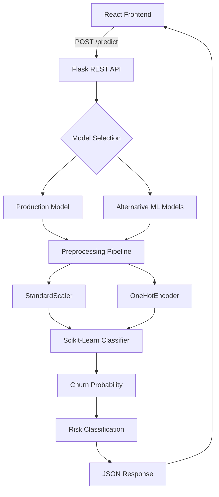

# ChurnIQ — Customer Churn Prediction & Multi-Model Intelligence System

> **An end-to-end Machine Learning platform for predicting customer churn, benchmarking multiple ML algorithms, analyzing customer risk, and serving real-time predictions through a Flask REST API with a modern React dashboard.**

**Live Demo:** [ChurnIQ Live Application](https://customer-churn-prediction-10fq.onrender.com/?utm_source=chatgpt.com)

---

## 🚀 Overview

**ChurnIQ** is a full-stack Machine Learning application designed to predict the probability of customer churn for telecommunications and subscription-based businesses.

The system combines:

- **7 Machine Learning algorithms**
- Automated **data preprocessing**
- Model benchmarking and evaluation
- Real-time churn prediction
- Customer risk classification
- Flask REST APIs
- React-based interactive dashboard
- Dark/Light theme system
- Production-ready deployment configuration

Instead of training a single model and stopping there, ChurnIQ provides a **multi-model intelligence layer** where different algorithms can be trained, compared, evaluated, and executed for live predictions.

The application uses a **scikit-learn preprocessing and prediction pipeline**, ensuring that the same transformations used during training are consistently applied during inference.

---

# ✨ Key Features

### 🤖 Multi-Model Machine Learning

ChurnIQ supports seven classification algorithms:

1. Logistic Regression
2. AdaBoost
3. Random Forest
4. Gradient Boosting
5. Decision Tree
6. K-Nearest Neighbors
7. Support Vector Machine

Each model is trained and evaluated using the same dataset and stratified train-test split.

---

### ⚙️ Automated Preprocessing Pipeline

The application automatically handles:

- Numerical feature scaling
- Categorical feature encoding
- Feature transformation
- Consistent training/inference preprocessing

The pipeline uses:

- `StandardScaler`
- `OneHotEncoder`
- Scikit-learn `Pipeline` / preprocessing workflow

This prevents the frontend from having to manually transform customer data.

---

### 🎯 Real-Time Churn Prediction

Users can enter customer information through the React interface and receive:

- Churn probability
- Risk percentage
- Risk category
- Model prediction

Risk classification:

| Churn Probability | Risk Level |
|---:|---|
| `< 35%` | 🟢 Low Risk |
| `35% – 65%` | 🟡 Medium Risk |
| `> 65%` | 🔴 High Risk |

---

### 📊 Model Benchmarking

The application provides a dedicated model comparison environment where the performance of all seven algorithms can be analyzed using:

- Accuracy
- Precision
- Recall
- F1-Score
- ROC-AUC

This makes it possible to understand the trade-offs between different models rather than relying only on accuracy.

---

### 🎨 Modern React Dashboard

The frontend provides a polished dashboard with:

- Pitch-black dark mode
- Clean white light mode
- Glassmorphism UI
- Radial gradient effects
- Neon violet/cyan accents
- Interactive risk meter
- Model performance visualization
- Prediction interface
- Model sandbox

---

### 📓 Step-by-Step Jupyter Notebook

The project also contains a structured notebook covering the complete Machine Learning workflow:

1. Dataset loading
2. Dataset exploration
3. Data cleaning
4. Feature preparation
5. Train-test splitting
6. Preprocessing
7. Model training
8. Model evaluation
9. Model comparison
10. Model serialization

This makes the ML pipeline easier to understand, reproduce, and explain during technical interviews.

---

# 📊 Machine Learning Model Performance

The models were trained on the **Customer Churn dataset containing 7,043 customer records** using an **80/20 stratified train-test split**.

| Model | Accuracy | Precision | Recall | F1-Score | ROC-AUC |
|---|---:|---:|---:|---:|---:|
| **Logistic Regression** | **80.6%** | 65.7% | **55.9%** | **60.4%** | 84.2% |
| **AdaBoost** | 79.7% | 66.1% | 48.4% | 55.9% | **84.5%** |
| **Random Forest** | 80.4% | **68.0%** | 49.5% | 57.3% | 84.1% |
| **Gradient Boosting** | 79.8% | 65.3% | 51.3% | 57.5% | 84.2% |
| **Decision Tree** | 79.4% | 63.0% | 54.5% | 58.5% | 82.8% |
| **K-Nearest Neighbors** | 76.7% | 56.3% | 54.8% | 55.6% | 80.1% |
| **Support Vector Machine** | 79.3% | 65.0% | 47.6% | 54.9% | 79.3% |

### Production Model Selection

**Logistic Regression** was selected as the production pipeline based on the overall balance of:

- Accuracy
- Recall
- F1-score
- ROC-AUC
- Prediction simplicity
- Interpretability
- Consistent performance

Although **AdaBoost achieved the highest ROC-AUC (84.5%)**, model selection was not based on a single metric. Logistic Regression provided the strongest overall balance for the application's production prediction workflow.

---

# 🧠 Machine Learning Workflow

```text
Raw Customer Dataset
        │
        ▼
Data Exploration
        │
        ▼
Data Cleaning
        │
        ▼
Feature Selection
        │
        ▼
Train / Test Split
        │
        ▼
Preprocessing Pipeline
 ┌─────────────────────┐
 │ Numerical Features  │
 │ StandardScaler      │
 └─────────────────────┘
          +
 ┌─────────────────────┐
 │ Categorical Features│
 │ OneHotEncoder       │
 └─────────────────────┘
        │
        ▼
┌─────────────────────────────┐
│     Model Training          │
│                             │
│ Logistic Regression         │
│ AdaBoost                    │
│ Random Forest               │
│ Gradient Boosting           │
│ Decision Tree               │
│ KNN                         │
│ SVM                         │
└─────────────────────────────┘
        │
        ▼
Model Evaluation
        │
        ▼
Model Comparison
        │
        ▼
Production Pipeline
        │
        ▼
Real-Time Prediction
```

---

# 🏗️ System Architecture



---

# 🔄 Application Flow

```text
User
 │
 ▼
React Dashboard
 │
 │ Customer Information
 ▼
Prediction Form
 │
 │ JSON Request
 ▼
Flask REST API
 │
 ▼
Model Pipeline
 │
 ├── Preprocessing
 │
 ├── Feature Transformation
 │
 └── Classification
 │
 ▼
Churn Probability
 │
 ▼
Risk Calculation
 │
 ▼
JSON Response
 │
 ▼
React Dashboard
 │
 ▼
Risk Meter + Prediction Result
```

---

# 🛠️ Technology Stack

## Frontend

| Technology | Purpose |
|---|---|
| React 18 | User interface |
| Vite 6 | Frontend tooling |
| JavaScript | Application logic |
| CSS | UI styling |
| React Router | Application navigation |

## Backend

| Technology | Purpose |
|---|---|
| Python 3.10+ | Backend & ML |
| Flask 3.0.3 | REST API |
| Gunicorn | Production server |
| Scikit-learn 1.6.1 | Machine Learning |
| NumPy / Pandas | Data processing |
| Joblib / Pickle | Model serialization |

## Machine Learning

- Logistic Regression
- AdaBoost
- Random Forest
- Gradient Boosting
- Decision Tree
- K-Nearest Neighbors
- Support Vector Machine
- StandardScaler
- OneHotEncoder
- Classification metrics
- ROC-AUC analysis

## Deployment

- Render
- Gunicorn
- Vite production build
- GitHub

---

# 📁 Project Structure

```text
Customer-churn-prediction/
│
├── CCP/
│   │
│   ├── backend/
│   │   ├── app.py
│   │   ├── customer_churn_model.pkl
│   │   ├── all_models.pkl
│   │   ├── requirements.txt
│   │   └── Procfile
│   │
│   └── frontend/
│       ├── src/
│       │   ├── App.jsx
│       │   ├── main.jsx
│       │   └── styles.css
│       │
│       ├── package.json
│       └── vite.config.js
│
├── data/
│   └── Customer-churn-details.csv
│
├── notebook/
│   ├── 01_Dataset_Exploration.ipynb
│   └── customer_churn_model.pkl
│
└── README.md
```

---

# 🔌 Backend API

The Flask backend exposes a prediction API consumed by the React frontend.

### Prediction Endpoint

```http
POST /predict
```

### Request

```json
{
  "gender": "Female",
  "seniorCitizen": 0,
  "partner": "Yes",
  "dependents": "No",
  "tenure": 12,
  "phoneService": "Yes",
  "internetService": "Fiber optic",
  "contract": "Month-to-month",
  "paymentMethod": "Electronic check"
}
```

### Response

```json
{
  "prediction": 1,
  "probability": 72.4,
  "risk": "High Risk"
}
```

> The exact request/response fields should match the implementation in `app.py`.

---

# 💻 Local Development

## Prerequisites

Make sure you have installed:

- Python 3.10+
- Node.js 18+
- npm
- Git

---

## 1. Clone the Repository

```bash
git clone <your-repository-url>

cd Customer-churn-prediction
```

---

# 🐍 2. Run Backend

Navigate to the backend:

```bash
cd CCP/backend
```

Install dependencies:

```bash
pip install -r requirements.txt
```

Start Flask:

```bash
python3 app.py
```

Backend:

```text
http://127.0.0.1:5000
```

---

# ⚛️ 3. Run Frontend

Open another terminal:

```bash
cd CCP/frontend
```

Install dependencies:

```bash
npm install
```

Start the Vite development server:

```bash
npm run dev
```

Frontend:

```text
http://localhost:5173
```

---

# ☁️ Deployment

## Backend — Render

The backend can be deployed as a Render Web Service.

### Configuration

**Root Directory**

```text
CCP/backend
```

**Build Command**

```bash
pip install -r requirements.txt
```

**Start Command**

```bash
gunicorn app:app
```

---

## Frontend — Render / Vercel

Build the React application:

```bash
npm run build
```

Production output:

```text
dist/
```

Configure the frontend to communicate with the deployed Flask API.

For production deployments, the API URL should be configured through an environment variable rather than hard-coded inside the React application.

Example:

```env
VITE_API_URL=https://your-backend-url.onrender.com
```

---

# 📈 Why Multiple Models?

Customer churn is a binary classification problem, but different algorithms can behave differently depending on the underlying data patterns.

ChurnIQ therefore compares multiple approaches:

### Logistic Regression

Useful as an interpretable baseline and performs well when the relationship between features and the target can be modeled approximately linearly.

### Random Forest

An ensemble of decision trees capable of modeling nonlinear relationships and interactions.

### Gradient Boosting

Builds models sequentially to improve performance by correcting previous prediction errors.

### AdaBoost

Combines multiple weak learners by emphasizing incorrectly classified observations.

### Decision Tree

Provides an easy-to-understand rule-based classification structure.

### KNN

Classifies customers based on similarity to nearby observations.

### SVM

Attempts to find an effective decision boundary between churn and non-churn customers.

---

# 📊 Evaluation Metrics

The project evaluates models using several complementary metrics.

### Accuracy

Percentage of total predictions that are correct.

```text
Accuracy =
Correct Predictions / Total Predictions
```

### Precision

Among customers predicted to churn, how many actually churned?

```text
Precision =
True Positives / (True Positives + False Positives)
```

### Recall

Among customers who actually churned, how many were correctly detected?

```text
Recall =
True Positives / (True Positives + False Negatives)
```

### F1-Score

Harmonic mean of precision and recall.

```text
F1 =
2 × (Precision × Recall)
-------------------------
   Precision + Recall
```

### ROC-AUC

Measures the model's ability to distinguish between churn and non-churn customers across classification thresholds.

---

# 📓 Notebook

The project includes a structured Jupyter Notebook:

```text
notebook/
└── 01_Dataset_Exploration.ipynb
```

The notebook demonstrates the Machine Learning process step-by-step, making it useful for:

- Learning
- Reproducibility
- Model analysis
- Debugging
- Technical presentations
- Interview preparation

---

# 🔐 Production Considerations

For a real production deployment, the following improvements can be added:

- Environment variables for configuration
- API authentication
- Rate limiting
- Input validation
- CORS configuration
- Structured logging
- Monitoring
- Model versioning
- Model drift detection
- Automated retraining
- Database integration
- Secure secret management
- CI/CD pipeline

---

# 🚀 Future Improvements

Planned improvements can include:

- [ ] Customer database integration
- [ ] Authentication and role-based access
- [ ] Historical prediction tracking
- [ ] Customer segmentation
- [ ] Explainable AI using SHAP
- [ ] Feature importance dashboard
- [ ] Model version management
- [ ] Automated model retraining
- [ ] Model drift monitoring
- [ ] Batch prediction through CSV upload
- [ ] Churn trend analytics
- [ ] Customer retention recommendations
- [ ] Email alerts for high-risk customers
- [ ] Docker containerization
- [ ] CI/CD deployment pipeline

---

# 💡 Business Use Case

Churn prediction can help subscription-based businesses identify customers who may be at risk of leaving.

A typical workflow could be:

```text
Customer Data
      │
      ▼
Churn Prediction
      │
      ▼
Risk Classification
      │
      ├── Low Risk
      │
      ├── Medium Risk
      │
      └── High Risk
             │
             ▼
     Retention Strategy
```

For example, a business could use high-risk predictions to prioritize customers for retention campaigns, personalized offers, customer-support outreach, or contract incentives.

> **Important:** A churn prediction is a probability estimate, not a guarantee that a customer will leave.

---

# 🎯 Project Highlights

### Machine Learning

- 7 classification algorithms
- Automated preprocessing
- Stratified train-test split
- Model benchmarking
- Multiple evaluation metrics
- Serialized production pipelines

### Backend

- Flask REST API
- Real-time prediction endpoint
- Multi-model execution
- JSON-based communication
- Gunicorn production server

### Frontend

- React SPA
- Vite
- Interactive dashboard
- Prediction interface
- Risk visualization
- Dark/Light themes
- Responsive UI

### Deployment

- Render-ready backend
- Vite production build
- Gunicorn configuration
- Cloud deployment support

---

# 🧪 Dataset

The project uses a telecommunications customer churn dataset containing:

```text
7,043 customer records
```

The dataset contains customer information related to areas such as:

- Demographics
- Customer tenure
- Services
- Internet services
- Contract information
- Payment methods
- Billing information
- Churn status

---

# 🏆 What This Project Demonstrates

ChurnIQ demonstrates practical knowledge across the complete Machine Learning application lifecycle:

```text
Data
 ↓
Exploration
 ↓
Preprocessing
 ↓
Feature Engineering
 ↓
Model Training
 ↓
Model Evaluation
 ↓
Model Comparison
 ↓
Model Serialization
 ↓
REST API
 ↓
React Frontend
 ↓
Cloud Deployment
```

This makes the project more than a standalone ML notebook — it demonstrates how a trained Machine Learning model can be integrated into a complete full-stack application.

---

# 📌 Resume Description

**ChurnIQ — Customer Churn Prediction & Multi-Model Intelligence System**

Developed an end-to-end Machine Learning web application using **Python, Scikit-learn, Flask, React, and Vite** to predict customer churn. Implemented and benchmarked **7 classification algorithms**, automated preprocessing using StandardScaler and OneHotEncoder, and achieved approximately **80.6% accuracy with Logistic Regression**. Built a Flask REST API for real-time predictions and a responsive React dashboard with interactive churn-risk visualization and multi-model analysis. Deployed the application using **Render and Gunicorn**.

---

# 👨‍💻 Author

**Aniruddh Parmar**

B.Tech Computer Science & Engineering  
Darshan University

---

# 📄 License

This project is licensed under the **MIT License**.

See the `LICENSE` file for details.

---

<p align="center">
  Built with Python, Scikit-learn, Flask, React & Vite
</p>

<p align="center">
  ⭐ If you found this project useful, consider giving the repository a star!
</p>
