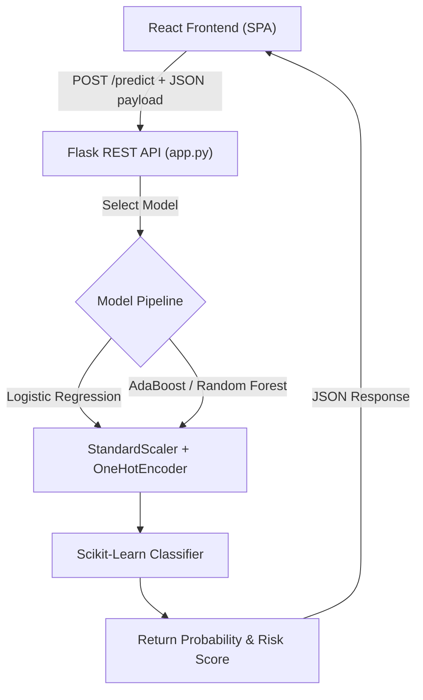

# 🚀 ChurnIQ - Customer Churn Prediction & Multi-Model Intelligence System


**ChurnIQ** is a full-stack, production-ready Machine Learning web application designed to predict customer churn probability for telecommunications and subscription-based businesses. Built with a scikit-learn preprocessing pipeline, a multi-model Flask backend REST API, and a futuristic React frontend featuring pitch-black dark mode & pristine white light mode.

---

## 🌟 Key Features

- **Multi-Model Benchmark & Sandbox**: Train, compare, and execute live predictions across **7 Machine Learning Algorithms** (Logistic Regression, AdaBoost, Random Forest, Gradient Boosting, Decision Tree, KNN, and SVM).
- **Automated Preprocessing Pipeline**: Raw customer data fields (Demographics, Services, Billing & Contract details) are automatically standard-scaled and one-hot encoded without manual feature engineering on the client side.
- **Ultra-Polished Dual Theme UI**:
  - **Pitch-Black Dark Mode**: True `#030305` base background with radial mesh gradients, glassmorphism card surfaces, and neon violet/cyan glowing accents.
  - **Pristine White Light Mode**: High-contrast, clean `#ffffff` theme for professional readability.
- **Interactive Risk Meter & Dial**: Real-time calculation of churn probability percentage categorized into **Low Risk (<35%)**, **Medium Risk (35% - 65%)**, and **High Risk (>65%)**.
- **Step-by-Step Jupyter Notebook**: Clean, humanized, cell-by-cell notebook with dedicated training and evaluation cells for every algorithm.
- **Deployment Ready**: Configured with `gunicorn`, `Procfile`, and `requirements.txt` for instant 1-click cloud deployment on platforms like **Render**, **Railway**, or **Vercel**.

---

## 📊 Machine Learning Model Leaderboard

All 7 models were trained on the Customer Churn dataset (7,043 instances) using an 80/20 stratified train-test split:

| Rank | Model | Accuracy (%) | Precision (%) | Recall (%) | F1-Score (%) | ROC-AUC (%) | Status / Recommended |
| :---: | :--- | :---: | :---: | :---: | :---: | :---: | :--- |
| 🥇 **1** | **Logistic Regression** | **80.6%** | **65.7%** | **55.9%** | **60.4%** | **84.2%** | **Production Selected Pipeline** |
| 🥈 **2** | **AdaBoost** | 79.7% | 66.1% | 48.4% | 55.9% | **84.5%** | **Highest ROC-AUC Score** |
| 🥉 **3** | **Random Forest** | 80.4% | **68.0%** | 49.5% | 57.3% | 84.1% | **Highest Precision Score** |
| 4 | **Gradient Boosting** | 79.8% | 65.3% | 51.3% | 57.5% | 84.2% | Robust Ensemble Boosting |
| 5 | **Decision Tree** | 79.4% | 63.0% | 54.5% | 58.5% | 82.8% | Single Tree Rules |
| 6 | **K-Nearest Neighbors** | 76.7% | 56.3% | 54.8% | 55.6% | 80.1% | Distance Cluster Matching |
| 7 | **Support Vector Machine** | 79.3% | 65.0% | 47.6% | 54.9% | 79.3% | Margin Boundary |

---

## 🏗️ System Architecture



---

## 📁 Repository Structure

```text
Customer-churn-prediction/
├── CCP/
│   ├── backend/
│   │   ├── app.py                     # Flask REST API server (multi-model prediction endpoint)
│   │   ├── customer_churn_model.pkl   # Serialized production pipeline
│   │   ├── all_models.pkl             # Serialized dictionary of all 7 trained pipelines
│   │   ├── requirements.txt           # Backend dependencies (flask, scikit-learn, gunicorn)
│   │   └── Procfile                   # Deployment command for Gunicorn
│   └── frontend/
│       ├── src/
│       │   ├── App.jsx                # React app with Dashboard, Predict, Sandbox & Performance pages
│       │   ├── styles.css             # Dual pitch-black / white theme glassmorphism CSS system
│       │   └── main.jsx               # App entry point with Router setup
│       ├── package.json               # Node.js dependencies
│       └── vite.config.js             # Vite build configuration
├── data/
│   └── Customer-churn-details.csv     # Raw customer churn dataset
├── notebook/
│   ├── 01_Dataset_Exploration.ipynb   # Step-by-step Jupyter Notebook with cell-by-cell evaluations
│   └── customer_churn_model.pkl       # Notebook exported model checkpoint
└── README.md                          # Project documentation
```

---

## 🛠️ Local Setup & Execution Guide

### Prerequisites
- **Python 3.10+**
- **Node.js 18+** & `npm`

---

### Step 1: Set Up & Run Backend Flask Server

1. Open terminal and navigate to backend directory:
   ```bash
   cd CCP/backend
   ```
2. Install Python dependencies:
   ```bash
   pip install -r requirements.txt
   ```
3. Start Flask API server:
   ```bash
   python3 app.py
   ```
   *The Flask API will run locally at `http://127.0.0.1:5000`.*

---

### Step 2: Set Up & Run Frontend React App

1. Open a second terminal window and navigate to frontend directory:
   ```bash
   cd CCP/frontend
   ```
2. Install Node packages:
   ```bash
   npm install
   ```
3. Start Vite development server:
   ```bash
   npm run dev
   ```
   *Open your browser and visit `http://localhost:5173` to view the application.*

---

## 🌐 Deploying to Production (Render / Vercel)

### Deploy Backend to Render (Free Web Service)

1. Push your code to a GitHub repository.
2. Sign in to [Render](https://render.com) and click **New +** $\rightarrow$ **Web Service**.
3. Connect your GitHub repository.
4. Set the root directory to `CCP/backend`.
5. Configure settings:
   - **Environment**: `Python 3`
   - **Build Command**: `pip install -r requirements.txt`
   - **Start Command**: `gunicorn app:app`
6. Click **Deploy Web Service**.

---

### Deploy Frontend to Render or Vercel

1. Create a new static site service on Render or Vercel.
2. Set root directory to `CCP/frontend`.
3. Configure settings:
   - **Build Command**: `npm run build`
   - **Publish Directory**: `dist`
4. Update `API` URL in `CCP/frontend/src/App.jsx` to your deployed Render backend URL.

---

## 📄 License

This project is open source and available under the [MIT License](LICENSE).
